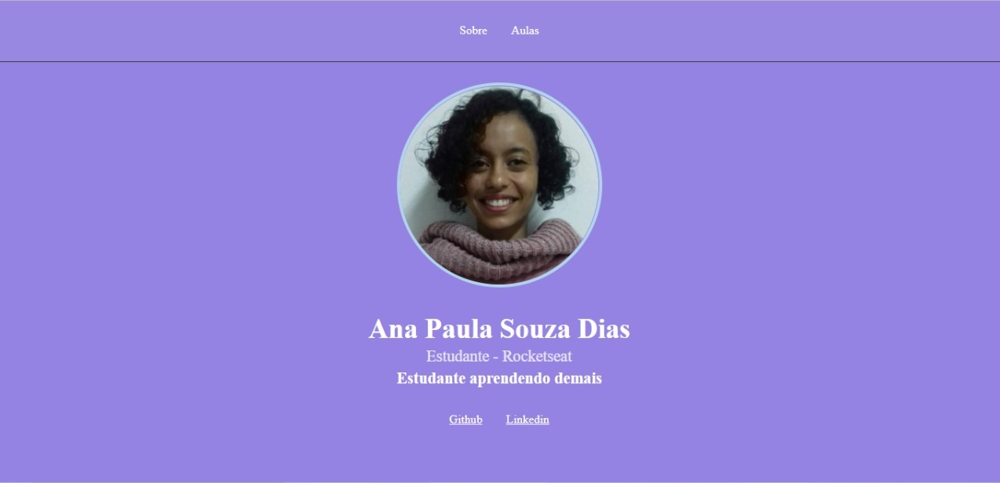
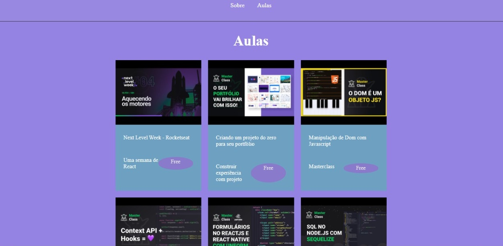
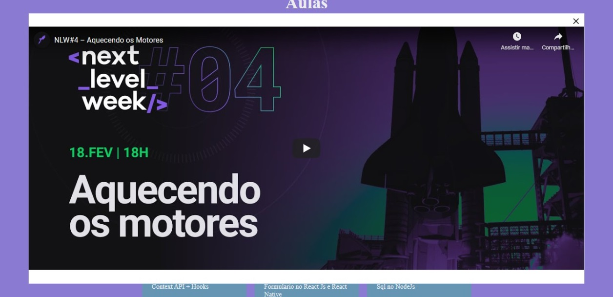

Este é um site que mostra o perfil principal da criadora e uma pagina com indicação de aulas sobre desenvolvimento que podem ser assitidos.

    <a href="README-pt.md">Portuguese</a>
 

   Projeto Inicial Launchbase. Construido com  ❤ por
    <a href="https://github.com/AnaPaulaSouzaDias">Ana Paula</a>  
  

   
   
   

# :computer: Tecnologias
Este projeto usou as seguintes tecnologias

* [Html]  
* [Css]
* [Javascript]   
     
# Clonar repositorio
$ git clone https://github.com/AnaPaulaSouzaDias/Site_inicial

Feito com amor por [Ana Paula Souza Dias](https://github.com/AnaPaulaSouzaDias) 🚀.
Este projeto esta pela licença [MIT license](./LICENSE).

Deixe uma ⭐ se este projeto te ajudou